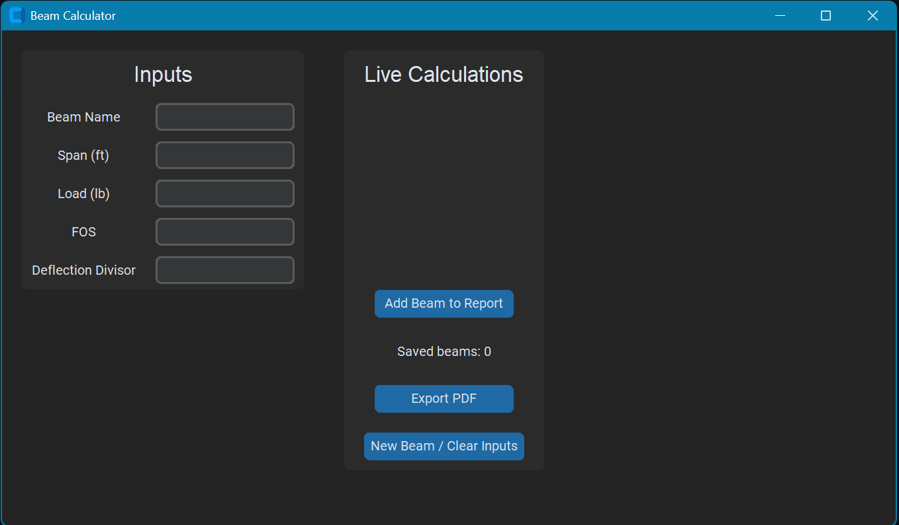

# Beam Calculator

A Python GUI application that helps select structural steel beams based on loading conditions and span requirements.

## Screenshot

## Overview

This program calculates the required bending moment for a beam and searches a steel beam database to recommend beam sizes that meet the required capacity.

The application was developed to simplify preliminary beam selection for residential and light structural design.

## Features

- Graphical User Interface (GUI)
- Calculates required beam moment
- Searches steel beam database
- Recommends suitable beam sizes
- Displays beam properties and capacities
- Generates a PDF report of the results

## Files

- `beam_gui.py` - Main application
- `steel_beams.csv` - Steel beam database
- `README.md` - Project documentation

## Technologies Used

- Python
- Tkinter
- CSV Data Processing
- ReportLab (PDF Generation)

## Example Workflow

1. Enter beam span and loading information.
2. Program calculates the required bending moment.
3. Steel beam database is searched.
4. Suitable beams are displayed.
5. Results can be exported to a PDF report.

## Skills Demonstrated

- Python Programming
- GUI Development
- Engineering Calculations
- Data Processing
- File Handling
- PDF Generation

## Future Improvements

- Deflection calculations
- Multiple load cases
- Metric and Imperial units
- Beam property visualizations
- Expanded steel shape database

## Disclaimer

This software is intended for educational and preliminary design purposes only. Final structural design should always be reviewed and approved by a qualified engineer.